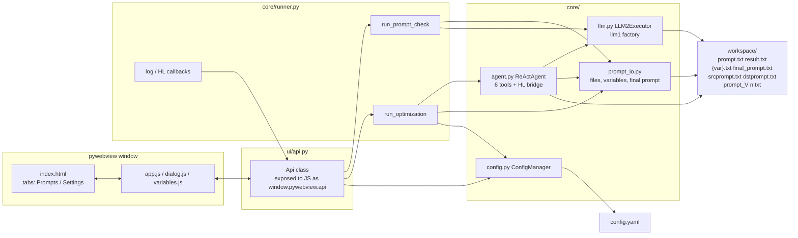
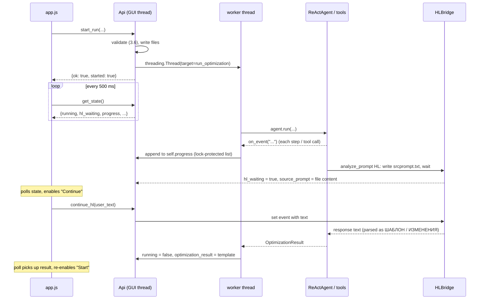
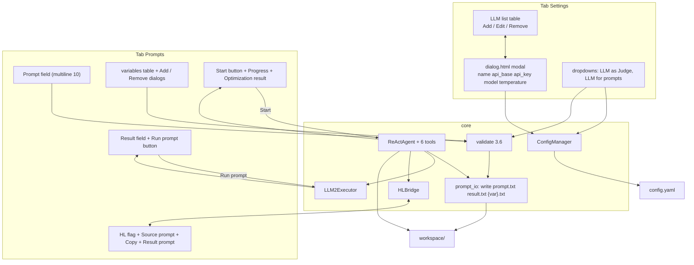

# Prompt Optimizer — Architecture

> Requirements: [`requirements/req_en.md`](requirements/req_en.md)
> Execution key template: [`scripts/template/interview_copilot.py`](scripts/template/interview_copilot.py)
> Reference design: [`scripts/template/design.md`](scripts/template/design.md)

## 1. Overview

Prompt Optimizer is a desktop application (pywebview + vanilla JS) that
interactively optimizes LLM prompts using the two-LLM ReAct scheme from the
reference template:

- **LLM for prompts (llm1)** — ReAct agent (`langgraph.create_react_agent`)
  that iteratively improves the prompt template;
- **LLM as Judge (llm2)** — a tool of the agent; a plain `ChatOpenAI` call
  that executes the final prompt and returns the raw result.

Unlike the CLI reference, the app supports:

- multiple named LLM configurations persisted in `config.yaml` (table with
  Add / Edit / Remove, dropdowns "LLM as Judge" and "LLM for prompts");
- a "Prompts" tab with prompt text, expected result, variables table
  (`{{variable}}` placeholders), one-shot "Run prompt" check, and a
  "Start" button that runs the full optimization loop with live logging;
- **Human-in-the-loop** mode: the `analyze_prompt` step is delegated to a
  human through the UI fields "Source prompt" (read-only + Copy to clipboard)
  and "Result prompt" (user input + "Continue" button), instead of the
  template's file-based `srcprompt.txt` / `dstprompt.txt` polling.

## 2. Folder Structure

```
promptoptimizer/
├── architecture.md              # this file
├── tasklist.md                  # implementation plan (task-by-task)
├── readme.md
├── requirements/
│   ├── req_en.md
│   └── req_rus.md
├── scripts/
│   ├── main/                    # application entry point
│   │   └── app.py               # creates window, exposes Api, runs worker
│   ├── template/                # reference implementation (NOT modified)
│   │   ├── interview_copilot.py
│   │   ├── design.md
│   │   └── config.yaml
│   ├── core/                    # reusable, UI-independent logic
│   │   ├── __init__.py
│   │   ├── config.py            # ConfigManager: load/save/validate config.yaml
│   │   ├── prompt_io.py         # write prompt.txt / result.txt / {var}.txt,
│   │   │                        # extract variables, build final prompt
│   │   ├── llm.py               # LLM2Executor + factory for llm1 ChatOpenAI
│   │   ├── agent.py             # ReActAgent (6 tools) + HL bridge hooks
│   │   └── runner.py            # run_prompt_check, run_optimization,
│   │                            # event/log callbacks, HL state machine
│   ├── ui/                      # pywebview layer
│   │   ├── __init__.py
│   │   ├── api.py               # Api class: all JS ↔ Python bridge methods
│   │   └── js/
│   │       ├── index.html       # two tabs: Prompts / Settings
│   │       ├── app.js           # tab logic, tables, buttons, polling
│   │       ├── dialog.html      # LLM add/edit dialog markup
│   │       ├── dialog.js        # dialog open/save/cancel
│   │       ├── variables.html   # variable add dialog markup
│   │       ├── variables.js     # variable add dialog logic
│   │       └── style.css        # styling, icon buttons, tooltips
│   └── tests/
│       ├── __init__.py
│       ├── test_config.py
│       ├── test_prompt_io.py
│       └── test_runner.py
├── config.yaml                  # user configuration (LLM list, roles, HL)
├── workspace/                   # per-run file sandbox (created at run time)
│   ├── prompt.txt
│   ├── result.txt
│   ├── {var}.txt
│   ├── final_prompt.txt
│   ├── srcprompt.txt
│   ├── dstprompt.txt
│   └── prompt_V<n>.txt
└── requirements.txt
```

Design rules:

- `core/` contains **no** pywebview imports — it can be run headless and
  unit-tested independently of the UI.
- The UI layer (`ui/`) never calls langchain directly; it only talks to
  `core.runner` through `ui.api.Api`.
- `scripts/template/` is the immutable reference; code is adapted from it,
  not imported from it.

## 3. Component Architecture



### 3.1 `core/config.py` — `ConfigManager`

Single owner of `config.yaml`. Responsibilities:

- `load() -> dict` — read YAML, validate shape, return dict;
- `save(data: dict)` — atomic write (tmp + replace), UTF-8;
- LLM list operations: `list_llms()`, `add_llm(cfg)`, `update_llm(name, cfg)`,
  `remove_llm(name)` — with name uniqueness check;
- role getters/setters: `get_role('judge' | 'optimizer') -> str` (LLM name),
  `set_role(role, name)`;
- validation: all 5 fields required and non-empty —
  `name`, `api_base`, `api_key`, `model`, `temperature` (float);
- HL flag: `get_hl() / set_hl(bool)`.

### 3.2 `core/prompt_io.py`

Ported from the template, decoupled from any class:

- `extract_variables_from_prompt(text) -> list[str]` — regex `\{\{(\w+)\}\}`;
- `write_run_files(base_dir, template, expected_result, variables: dict[str, str])`
  — writes `prompt.txt`, `result.txt`, one `{var}.txt` per variable;
- `build_final_prompt(template, base_dir) -> str` — substitutes variables from
  files, writes `final_prompt.txt`, returns its path;
- `load_expected_result(base_dir) -> str`.

### 3.3 `core/llm.py`

- `LLM2Executor` — direct port of the template class (reads
  `final_prompt.txt`, `ChatOpenAI` with `reasoning_effort=None`);
- `make_llm1(llm_cfg) -> ChatOpenAI` — factory used by `ReActAgent`,
  same `reasoning_effort=None` rule.

### 3.4 `core/agent.py` — `ReActAgent`

Port of the template `ReActAgent` with two deliberate changes:

1. **Logging hooks.** Constructor accepts `on_event: Callable[[str], None]`.
   Every tool call and step emits an event string, e.g.
   `"[STEP 3] llm2: executed final prompt (412 chars)"`,
   `"[TOOL] analyze_prompt -> 12 changes"`. The runner forwards events to the
   UI "Progress" field via `window.evaluate_js`.
2. **Human-in-the-loop bridge.** The template's HL mode polls
   `dstprompt.txt` in a blocking `while True` loop — that approach is
   incompatible with a GUI (blocks the thread, no UI feedback). Instead:

   - `analyze_prompt` in HL mode writes the analysis prompt to
     `srcprompt.txt` **and** invokes `self._hl_bridge(src_prompt)`;
   - `HLBridge` (injected by the runner) is a callable object:
     `wait_for_response() -> str`. For the GUI it is implemented with
     `threading.Event`: the runner sets the "Source prompt" field, enables
     "Continue", waits on the event; the "Continue" click handler reads the
     "Result prompt" field and sets the event with the user text.
   - The rest of the tool contract (response format `ШАБЛОН:` / `ИЗМЕНЕНИЯ:`,
     parsing, `_change_history`) is unchanged.

Tools (unchanged from the template): `build_prompt`, `llm2`,
`explain_result`, `analyze_prompt`, `save_prompt`, `finish`.
`recursion_limit = max_attempts * 10`.

### 3.5 `core/runner.py` — orchestration

UI-independent orchestration used by both "Run prompt" and "Start":

```python
def run_prompt_check(role_cfgs, template, expected, variables, base_dir,
                     on_event) -> str
    # validation → write files → build_final_prompt → LLM2Executor.execute()

def run_optimization(role_cfgs, template, expected, variables, base_dir,
                     hl: bool, on_event, hl_bridge) -> OptimizationResult
    # validation → write files → ReActAgent(...).run(...)
    # returns dataclass: success, final_template, final_result, attempts
```

`role_cfgs` resolves names → concrete LLM dicts from `ConfigManager`
("judge" name → llm2 dict, "optimizer" name → llm1 dict, plus `max_attempts`).

**Validation (req 3.6)** — `validate_run_inputs(...) -> list[str]` returns a
list of human-readable errors; the runner aborts and the UI shows the first
error:

- role "LLM as Judge" is selected and that LLM exists in the list;
- role "LLM for prompts" is selected and that LLM exists in the list;
- prompt text is non-empty;
- every `{{var}}` found in the prompt text has a non-empty value in the
  variables table.

### 3.6 `ui/api.py` — JS ↔ Python bridge

`Api` is the single object exposed to JavaScript. All methods are thin
wrappers around `ConfigManager` / `runner` / `HLBridge`.

| Method | Purpose |
|---|---|
| `get_config() -> dict` | whole config for initial render |
| `list_llms() -> list[dict]` | table rows (2.2.1) |
| `save_llm(cfg: dict) -> dict` | add or update (scenario 3.1 / 3.2) |
| `remove_llm(name) -> dict` | delete with confirm (3.3); also clears roles that referenced it |
| `get_roles() -> dict` / `set_role(role, name)` | dropdowns (3.4) |
| `get_hl() -> bool` / `set_hl(flag)` | HL flag (2.1.3) |
| `run_prompt(template, result, variables) -> dict` | one-shot "Run prompt" (3.5) → `{ok, error?, result?}` |
| `start_run(template, result, variables, hl) -> dict` | launches worker thread (3.7) |
| `continue_hl(response_text) -> None` | fills HL response, releases the bridge event |
| `get_state() -> dict` | polled from JS every 500 ms |
| `copy_to_clipboard(text) -> None` | "Copy" button (2.1.3) |
| `get_llm_dialog() -> dict` / `get_variable_dialog() -> dict` | dialog payloads for JS modal windows |

`get_state()` returns:

```json
{
  "running": false,
  "hl_waiting": false,
  "progress": "...log lines...",
  "source_prompt": "",
  "optimization_result": "",
  "start_button": {"enabled": true, "text": "Start"}
}
```

### 3.7 Threading model

pywebview executes `Api` methods on the GUI thread, so long work must not
block it:



- One global worker thread at a time; "Start" is disabled while `running`.
- All mutable UI-visible state is guarded by `threading.Lock`.
- Log lines are appended to a bounded deque (last 500 lines) and rendered as
  text in the "Progress" field.

### 3.8 HL mode contract (vs the template)

| Aspect | Template (CLI) | App (GUI) |
|---|---|---|
| Trigger | `HL: true` in config.yaml | "Human-in-the-loop" checkbox (persisted in config.yaml) |
| Source prompt | `srcprompt.txt` on disk | written to `workspace/srcprompt.txt` **and** shown in "Source prompt" field (Copy button → clipboard) |
| Waiting | blocking `while` poll every 1 s | `threading.Event` in `HLBridge`; UI polls `get_state()` |
| Response | human edits `dstprompt.txt` | user types into "Result prompt" field, clicks "Continue" |
| Button state | n/a | "Start" → enabled, text "Continue"; after click → disabled "Start" again |
| Invalid click | n/a | clicking "Result prompt" while not waiting → user error message |

## 4. Data Flow



## 5. Optimization Algorithm

Identical to the reference template (section 5 of
[`scripts/template/design.md`](scripts/template/design.md)) — per iteration:

1. `build_prompt(template)` — substitute `{{var}}` values from files → `final_prompt.txt`;
2. `llm2()` — execute the final prompt, return raw result;
3. agent semantically compares the result with the expected one;
4. **match** → `finish(template)`;
5. **mismatch** → `explain_result` (≥ 3 clarification questions, JSON) →
   `analyze_prompt` (LLM or human via HL bridge; format `ШАБЛОН:` / `ИЗМЕНЕНИЯ:`)
   → `save_prompt` → `prompt_V<n>.txt` → repeat from step 1;
6. bounded by `max_attempts` (llm1 config) and `recursion_limit = max_attempts * 10`.

The final template (from `finish`, else last AIMessage, else initial) is shown
in the "Optimization result" field.

## 6. config.yaml Schema

```yaml
# Prompt Optimizer configuration
llms:
  - name: "qwen-judge"            # unique, used in dropdowns and tables
    api_base: "http://192.168.1.4:1234/v1"
    api_key: "sk-..."
    model: "qwen/qwen3.8-27b"
    temperature: 0.0              # float
  - name: "gemma-target"
    api_base: "http://192.168.1.57:1234/v1"
    api_key: "EMPTY"
    model: "google/gemma-4-12b-qat"
    temperature: 0.0

roles:
  judge: "qwen-judge"             # "LLM as Judge" dropdown value
  prompts: "gemma-target"         # "LLM for prompts" dropdown value

hl: false                         # Human-in-the-loop flag (2.1.3)
max_attempts: 30                  # optimization loop cap (llm1)
```

Migration note: the template's `llm1` / `llm2` / `HL` keys are **not**
reused — the new schema normalizes them into `llms[]` + `roles`. The two
reference endpoints from [`scripts/template/config.yaml`](scripts/template/config.yaml)
serve as the initial seed values for `config.yaml`.

## 7. UI Design

### 7.1 Layout

```
┌────────────────────────────────────────────────────────────┐
│  [ Prompts ]  [ Settings ]                                 │
├────────────────────────────────────────────────────────────┤
│ PROMPTS TAB                                                │
│ ┌ Prompt settings ───────────────────────────────────────┐ │
│ │ Prompt:        [ multiline 10 lines ................ ] │ │
│ │ Result:        [ multiline 10 lines ................ ] │ │
│ │                 [Run prompt]                           │ │
│ │ Variables:      [Add] [Remove]                         │ │
│ │  ┌──────────────────────────────────────────────┐      │ │
│ │  │ Variable  │ Value                            │      │ │
│ │  ├──────────────────────────────────────────────┤      │ │
│ │  └──────────────────────────────────────────────┘      │ │
│ └─────────────────────────────────────────────────────────┘ │
│ ┌ Execution ─────────────────────────────────────────────┐ │
│ │ [Start]  Progress: [ multiline 10 lines ........... ] │ │
│ │ Optimization result: [ multiline 10 lines ......... ] │ │
│ └─────────────────────────────────────────────────────────┘ │
│ ┌ Human-in-the-loop ─────────────────────────────────────┐ │
│ │ [x] Human-in-the-loop                                  │ │
│ │ Source prompt: [ multiline 10 ... ]  [Copy]            │ │
│ │ Result prompt: [ multiline 10 ... ]                    │ │
│ └─────────────────────────────────────────────────────────┘ │
├────────────────────────────────────────────────────────────┤
│ SETTINGS TAB                                               │
│ LLM list:  [Add] [Edit] [Remove]                           │
│ ┌──────────────────────────────────────────────────────┐   │
│ │ name │ api_base │ api_key │ model │ temperature      │   │
│ └──────────────────────────────────────────────────────┘   │
│ LLM as Judge:   [ dropdown ............................ ]   │
│ LLM for prompts:[ dropdown ............................ ]   │
└────────────────────────────────────────────────────────────┘
```

### 7.2 Styling rules (req "Styles")

- all fields are single-line text by default; explicitly marked fields
  (Prompt, Result, Progress, Optimization result, Source prompt, Result
  prompt) are multiline, 10 lines high; variable "Value" dialog field is
  multiline, 5 lines high;
- buttons render as **icons** (inline SVG); a text tooltip appears on hover
  (`title` attribute + CSS tooltip for reliability);
- dialogs (LLM add/edit, variable add) are in-page modals (no separate
  pywebview window) — one window, simpler state, no cross-window IPC.

### 7.3 Icon buttons

| Button | Icon | Tooltip |
|---|---|---|
| Run prompt | ▶ | "Run prompt" |
| Start | ▶ / ⏵ | "Start" → "Continue" in HL wait |
| Copy | ⧉ | "Copy to clipboard" |
| Add (LLM) | ＋ | "Add LLM" |
| Edit (LLM) | ✎ | "Edit LLM" |
| Remove (LLM) | ✕ | "Remove LLM" |
| Add (variable) | ＋ | "Add variable" |
| Remove (variable) | ✕ | "Remove variable" |
| Save (dialog) | ✓ | "Save" |
| Cancel (dialog) | ✕ | "Cancel" |

## 8. Error Handling

| Situation | Behavior |
|---|---|
| Validation 3.6 fails (roles / prompt / variables) | action aborted; first error shown in a toast; no files written |
| LLM API key empty / placeholder | `ValueError` with hint to Settings tab; surfaced via log + toast |
| `{var}.txt` missing at build time | warning in Progress log; variable substituted with `""` (template behavior) |
| `final_prompt.txt` missing for llm2 | `FileNotFoundError` — cannot happen via the runner (build always precedes) but kept as a guard |
| Agent never calls `finish` | `success = False`; fallback: last AIMessage → initial template; result still shown |
| Analyzer response without `ИЗМЕНЕНИЯ:` | whole response treated as template; history not updated (template behavior) |
| HL: user clicks "Result prompt" while not waiting | JS-side user error ("Enter a response and press Continue") |
| HL: user clicks "Continue" with empty response | error, bridge not released |
| config.yaml unreadable / invalid schema | app refuses to start with a clear message |

## 9. Technology Stack

- **Python 3.10+** — `list[str]` annotations throughout;
- **langchain-core** — `@tool`, messages;
- **langchain-openai** — `ChatOpenAI` against any OpenAI-compatible endpoint
  (`api_base` configurable); `reasoning_effort=None` on **every** LLM call;
- **langgraph** — `create_react_agent` ReAct runtime;
- **PyYAML** — configuration;
- **pywebview** — desktop window hosting the HTML/JS UI;
- **vanilla JavaScript** — all DOM logic, no framework.

## 10. Dependencies (`requirements.txt`)

```
langchain-core
langchain-openai
langgraph
PyYAML
pywebview
```
