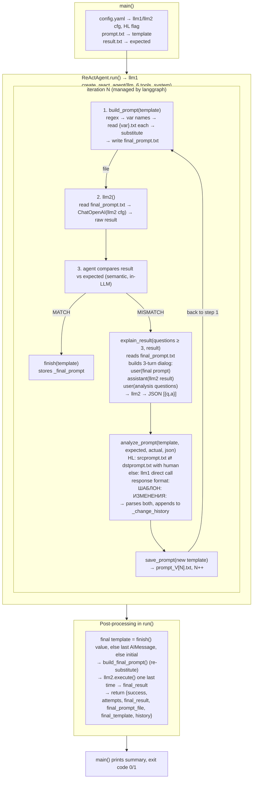

# Interview Copilot — Architecture & Design

> Source: [`interview_copilot.py`](testprompt/interview_copilot.py)
> Config: [`config.yaml`](testprompt/config.yaml)

## 1. Overview

Interview Copilot is a **prompt-optimization agent**. It receives:

- a **prompt template** (`prompt.txt`) containing variable placeholders in the form `{{variable_name}}`;
- an **expected result** (`result.txt`);

and iteratively improves the template until the output of the target LLM (llm2)
semantically matches the expected result, or the attempt limit is exhausted.

The system is built on a **two-LLM** scheme:

| Role  | What it is                                                       | Technology                        |
|-------|------------------------------------------------------------------|-----------------------------------|
| llm1  | **ReAct agent** — analyzes, compares, corrects the template      | `langchain` + `langgraph` (`create_react_agent`) |
| llm2  | **Tool** of the ReAct agent — a plain LLM call that executes the final prompt | `ChatOpenAI` (OpenAI-compatible API) |

## 2. Key Design Decisions

### 2.1 Separation of template and variable values
Variable **values** are never passed to the agent (llm1) or to llm2.
The agent only ever sees the **template** with placeholder *names*
(`{{var}}`). Substitution is performed by **Python-side code**
(`build_final_prompt`), which reads each `{{var}}.txt` file from
`base_dir` by name and writes the fully-substituted prompt to
`final_prompt.txt`. llm2 then reads the prompt from that file.

Why:
- keeps the agent's context small and stable;
- guarantees deterministic substitution (no LLM can "forget" a value);
- allows llm2 to accept **no arguments** (`llm2()`), simplifying the tool contract.

### 2.2 File-based communication between tools
The tools interact through **files in `base_dir`**, not through return values:

```
build_prompt(template)  →  writes  final_prompt.txt
llm2()                  →  reads   final_prompt.txt  →  returns raw LLM output
explain_result(...)     →  reads   final_prompt.txt  (+ the llm2 result from agent memory)
```

`final_prompt.txt` is a single shared "current prompt" slot: every call to
`build_prompt` overwrites it, so `llm2` always executes the latest version.

### 2.3 ReAct agent with a fixed tool set
llm1 is created via `langgraph.prebuilt.create_react_agent` with a
**system prompt** (Russian) that describes the complete algorithm, and a
**user task** containing the initial template and the expected result.
The loop of "think → call tool → observe" is managed by the langgraph
runtime; the `recursion_limit` is set to `max_attempts * 10` to cap total steps.

### 2.4 Self-comparison by the agent
The match between the actual and expected result is judged **by the agent
itself** (semantic comparison, per the system prompt). There is no
deterministic comparator in the Python code.

### 2.5 Human-in-the-loop (HL) mode
When `HL: true` in [`config.yaml`](testprompt/config.yaml), the
`analyze_prompt` tool does **not** call llm1. Instead it:
1. writes the analysis prompt to `srcprompt.txt`;
2. clears `dstprompt.txt`;
3. polls `dstprompt.txt` every second until a human fills it in;
4. reads the human-provided response (same `ШАБЛОН:` / `ИЗМЕНЕНИЯ:` format).

This lets a human replace the analyzer LLM step while keeping the whole
tool contract unchanged.

### 2.6 Change history for the analyzer
Every improvement adds a short "what changed and why" note to
`ReActAgent._change_history`. On the next `analyze_prompt` call this
history is injected into the analysis prompt so the analyzer does not
repeat previously applied fixes.

### 2.7 Versioned template snapshots
`save_prompt(template)` writes each corrected template to
`prompt_V<n>.txt` (attempt number tracked in `self._current_attempt`),
giving a full auditable trail of the evolution of the prompt.

## 3. Components & Structure

```
interview_copilot.py
├── load_config(path)                 # YAML → dict
├── extract_variables_from_prompt()   # regex \{\{(\w+)\}\} → [names]
├── build_final_prompt(template, base_dir)
│       # reads {var}.txt files, substitutes, writes final_prompt.txt
├── save_final_prompt(template, attempt, output_dir)
│       # writes prompt_V[attempt].txt
├── load_result(result_path)          # reads expected result
│
├── class LLM2Executor                # "llm2" — tool backend
│   ├── __init__(config)              # api_base, api_key, model, temperature, base_dir
│   └── execute() → str               # reads final_prompt.txt → ChatOpenAI → content
│
└── class ReActAgent                  # "llm1" — optimizer agent
    ├── SYSTEM_PROMPT                 # full algorithm (RU), {max_attempts} placeholder
    ├── __init__(llm2_executor, llm1_config, max_attempts, hl)
    ├── _get_llm()                    # lazy ChatOpenAI for llm1
    ├── _make_tools(...) → [6 tools]
    │   ├── build_prompt(template)
    │   ├── llm2()
    │   ├── explain_result(analysis_request, llm2_result)
    │   ├── analyze_prompt(current_template, expected, actual, explain_answer="")
    │   ├── save_prompt(template)
    │   └── finish(final_template)
    └── run(template, expected, base_dir, output_dir) → dict
│
main()                                # entry point: load → build → run → summary
```

### File I/O layout (all under `base_dir` = script directory)

| File              | Producer              | Consumer            | Purpose                          |
|-------------------|-----------------------|---------------------|----------------------------------|
| `config.yaml`     | user                  | `load_config`       | API credentials, model, HL flag  |
| `prompt.txt`      | user                  | `main`              | initial prompt template          |
| `result.txt`      | user                  | `main`              | expected result                  |
| `{{var}}.txt`     | user                  | `build_final_prompt`| value of each template variable  |
| `final_prompt.txt`| `build_prompt` tool   | `llm2` / `explain_result` | current fully-substituted prompt |
| `srcprompt.txt`   | `analyze_prompt` (HL) | human               | analysis prompt for the human    |
| `dstprompt.txt`   | human                 | `analyze_prompt` (HL)| human's response (template+changes)|
| `prompt_V<n>.txt` | `save_prompt` tool    | (audit)             | versioned template snapshots     |

## 4. Data Flow



## 5. Optimization Algorithm (per iteration)

1. **Build** — `build_prompt` substitutes variables from `{var}.txt` into the
   template → `final_prompt.txt`.
2. **Execute** — `llm2()` runs the final prompt through the target LLM.
3. **Compare** — the agent semantically compares output vs `result.txt`.
4. **Match** → `finish(template)` — loop ends with success.
5. **Mismatch** →
   a. `explain_result`: a 3-turn dialog with llm2 asking **≥ 3 clarification
      questions** about which phrases of the prompt caused the discrepancy;
      returns a JSON array `[{"question": ..., "answer": ...}]`.
   b. `analyze_prompt`: a dedicated llm1 call breaks the prompt into
      semantic units, evaluates each unit against expected/actual results
      (using the explain-JSON as targeted context and the change history to
      avoid regressions), and returns a corrected template + change summary.
   c. `save_prompt`: persist the version, then the loop repeats from step 1.
6. The loop is bounded by `max_attempts` (llm1 config) and by
   `recursion_limit = max_attempts * 10` graph steps.

## 6. Failure Handling

| Situation                              | Behavior                                                        |
|----------------------------------------|-----------------------------------------------------------------|
| API key missing / placeholder          | `ValueError` with a pointer to `config.yaml`                    |
| `final_prompt.txt` absent for llm2     | `FileNotFoundError` (build_prompt must run first)               |
| Variable file `{var}.txt` missing      | warning printed, variable substituted with empty string         |
| `langchain` packages missing           | `ImportError` with `pip install` hint                           |
| Agent never calls `finish`             | `success = False`; falls back to last AIMessage content, then to the initial template |
| Analyzer response lacks `ИЗМЕНЕНИЯ:`   | whole response treated as template; history not updated         |

## 7. Technology Stack

- **Python 3.10+** (`list[str]` annotations)
- **langchain-core** — `@tool` decorators, messages
- **langchain-openai** — `ChatOpenAI` against any OpenAI-compatible endpoint
  (`api_base` is configurable; in the shipped config both LLMs point at
  local vLLM-style servers: qwen for llm1, gemma for llm2)
- **langgraph** — `create_react_agent` ReAct runtime
- **PyYAML** — configuration
- `reasoning_effort=None` is explicitly set on every LLM call to disable
  extended-thinking modes on the local servers

## 8. Run Modes

- **`HL: false`** — fully automatic: llm1 both drives the ReAct loop and
  performs `analyze_prompt` directly.
- **`HL: true`** (current config) — the analysis step is delegated to a human
  via `srcprompt.txt` / `dstprompt.txt`; everything else remains automatic.
