# Prompt Optimizer — Implementation Task List

> Companion to [`architecture.md`](architecture.md). Tasks are ordered so that
> **every phase ends with something visibly testable in the GUI** (the
> "GUI test" step of each phase).
> Reference implementation to adapt: [`scripts/template/interview_copilot.py`](scripts/template/interview_copilot.py).

## GUI test strategy

- From Phase 2 on, the real window (two tabs, real `index.html`) exists and
  is launched via `python scripts/main/app.py` for manual verification.
- Phases 3–7 wire real backend logic behind stubbed/placeholder UI
  behavior, so each phase's GUI test shows a new capability end-to-end
  (config → files → one-shot LLM → auto run → HL run → polish).
- A small console smoke helper `scripts/dev/smoke_core.py` (T3.4) verifies
  the headless core (config + prompt_io) without a window, in parallel with
  the GUI tests.
- "GUI test" steps are manual: launch the app, perform the listed actions,
  check the listed observable outcomes (fields, tables, toasts, files in
  `workspace/`, `config.yaml` content).

## Phase 0 — Project bootstrap

- [ ] **T0.1** Create folder structure per architecture §2:
      `scripts/main/`, `scripts/core/`, `scripts/ui/js/`, `scripts/dev/`,
      `scripts/tests/`, `workspace/` (with `.gitkeep`).
- [ ] **T0.2** Create `requirements.txt` with: `langchain-core`,
      `langchain-openai`, `langgraph`, `PyYAML`, `pywebview`.
- [ ] **T0.3** Create seed `config.yaml` from the schema in architecture §6,
      seeded with the two LLMs from
      [`scripts/template/config.yaml`](scripts/template/config.yaml)
      (`qwen-judge` / `gemma-target`), `roles`, `hl: false`, `max_attempts: 30`.
- [ ] **T0.4** Add package inits: `scripts/core/__init__.py`,
      `scripts/ui/__init__.py`, `scripts/tests/__init__.py`.
- [ ] **T0.5** `python -c "import core"` works from the project root
      (paths set up so `scripts/` is on `sys.path` in `app.py`).

*No GUI yet — scaffolding only.*

## Phase 1 — Config core + skeleton UI (GUI test: the window)

- [x] **T1.1** `core/config.py` — `ConfigManager`: `load()` with schema
      validation (`llms[]`, 5 required fields per entry, `roles` referencing
      existing names, `hl`, `max_attempts`); `save()` atomic (tmp +
      `os.replace`).
- [x] **T1.2** `validate_llm_entry(cfg) -> list[str]` — non-empty fields,
      float temperature.
- [x] **T1.3** `ui/js/index.html` — two-tab skeleton: "Prompts" / "Settings"
      with the section shells from architecture §7.1 (empty tables/fields,
      labels already in place).
- [x] **T1.4** `ui/js/style.css` — base layout: tabs, sections, multiline
      fields sized to 10 lines, icon-button style + hover tooltips, table
      and modal base styles.
- [x] **T1.5** `ui/js/app.js` — tab switching only; on load call
      `window.pywebview.api.get_config()` and log the result to the page
      (small status line) to prove the bridge works.
- [x] **T1.6** `ui/api.py` — `Api` class with `get_config()` implemented;
      all other methods from architecture §3.6 as stubs returning
      `{"ok": False, "error": "not implemented"}`.
- [x] **T1.7** `scripts/main/app.py` — `main()`: load config (fail clearly
      on invalid schema), create `Api`, `webview.create_window(...)`,
      `webview.start()`.
- [x] **T1.8** Unit tests `scripts/tests/test_config.py` (part 1): load/save
      round-trip, invalid schema rejection.

**GUI test (Phase 1):** launch the app → window opens, both tabs switch,
the status line shows the parsed config (LLM count, roles). Kill and
restart → same behavior.

## Phase 2 — Settings tab: LLM table + CRUD (GUI test: manage LLMs)

- [ ] **T2.1** `ConfigManager` LLM CRUD: `list_llms()`, `add_llm(cfg)`,
      `update_llm(name, cfg)`, `remove_llm(name)` — duplicate-name
      rejection; removing an LLM clears any role referencing it.
- [ ] **T2.2** Role accessors: `get_roles()`, `set_role(role, name)`,
      `get_hl()`, `set_hl(flag)`.
- [ ] **T2.3** `Api`: implement `list_llms`, `save_llm`, `remove_llm`,
      `get_roles`, `set_role` on top of `ConfigManager`.
- [ ] **T2.4** `dialog.html` + `dialog.js` — in-page modal for LLM add/edit:
      fields name, api_base, api_key, model, temperature; client-side
      required-field validation; Save → `api.save_llm(cfg)`, Cancel → close;
      error from the bridge shown in the modal.
- [ ] **T2.5** `app.js` — Settings tab render: table populated from
      `api.list_llms()`; interactions: Add → open dialog; double-click row
      **or** Edit button → dialog prefilled; Remove → `confirm()` →
      `api.remove_llm(name)`; after every mutation re-render table.
- [ ] **T2.6** Role dropdowns + HL checkbox: populated from the LLM list;
      change → `api.set_role(...)` / `api.set_hl(...)`; if a selected LLM is
      removed → dropdown cleared.
- [ ] **T2.7** Unit tests `test_config.py` (part 2): duplicate rejection,
      remove cascades to roles, atomic write.

**GUI test (Phase 2):** scenario 3.1 — Add button → fill dialog → Save →
row appears and `config.yaml` on disk contains the new LLM. Scenario 3.2 —
double-click the row (and separately via Edit button) → change temperature →
Save → row + file updated. Scenario 3.3 — select row → Remove → confirm →
row gone, file updated, role dropdown referencing it cleared. Scenario 3.4 —
pick a role in both dropdowns → toggle HL → restart app → all selections
restored from `config.yaml`.

## Phase 3 — Prompt I/O core + Prompts tab form (GUI test: variables & validation)

- [ ] **T3.1** `core/prompt_io.py`: `extract_variables_from_prompt` (regex
      `\{\{(\w+)\}\}`, deduplicated), `write_run_files(base_dir, template,
      expected, variables)` (fresh `workspace/`: prompt.txt, result.txt,
      `{var}.txt` per variable), `build_final_prompt`, `load_expected_result`.
- [ ] **T3.2** `runner.validate_run_inputs(config_data, template,
      variables) -> list[str]` per req 3.6: roles selected + LLMs exist,
      prompt non-empty, every `{{var}}` in the prompt has a non-empty value.
- [ ] **T3.3** `Api`: implement `run_validation(template, result,
      variables)` — returns `{"ok": True}` or `{"ok": False, "errors": [...]}`
      (no files written yet — pure check).
- [ ] **T3.4** `scripts/dev/smoke_core.py` — headless smoke: load config,
      extract variables from a sample template, write `workspace/` files,
      `build_final_prompt`, print the result (verifies Phase 1–3 core
      without the window).
- [ ] **T3.5** `app.js` — Prompts tab form: Prompt field (multiline, 10
      lines), Result field (multiline, 10 lines); variables table
      (Variable | Value) with Add/Remove icon buttons.
- [ ] **T3.6** `variables.html` + `variables.js` — modal: "Variable name"
      (single-line) + "Value" (multiline, 5 lines); Save → row added;
      Remove → row deleted; duplicate variable name rejected client-side.
- [ ] **T3.7** `app.js` — validation feedback: on any change of
      Prompt/Result/variables/roles, re-run `api.run_validation` (debounced
      400 ms) and render a small warning strip under the form listing the
      errors from req 3.6 (or nothing when valid).
- [ ] **T3.8** Unit tests `scripts/tests/test_prompt_io.py`: extraction
      (incl. repeated variables), file writing, substitution with a missing
      variable file (empty string + warning), UTF-8.
- [ ] **T3.9** Unit tests `scripts/tests/test_validation.py`: full 3.6
      matrix (each failure mode individually + all-valid case).

**GUI test (Phase 3):** enter a prompt containing `{{city}}` and `{{topic}}`
→ variable names appear in the warning strip; add both variables with values
→ strip clears. Empty the Result field → "Result is required"-style error
appears. Unset a role in Settings → the corresponding error appears in
Prompts tab. Run `scripts/dev/smoke_core.py` → correct files in `workspace/`.

## Phase 4 — LLM layer + "Run prompt" (GUI test: real one-shot LLM call)

- [ ] **T4.1** `core/llm.py`: port `LLM2Executor` from the template verbatim
      (reads `final_prompt.txt`, `ChatOpenAI`, `reasoning_effort=None`,
      system message "Respond directly without showing your reasoning");
      API-key validation.
- [ ] **T4.2** `make_llm1(llm_cfg) -> ChatOpenAI` factory (same
      `reasoning_effort=None` rule) — used by the agent in Phase 6.
- [ ] **T4.3** `runner.resolve_role_configs(config_data) -> (llm1_cfg,
      llm2_cfg)` — maps role names to LLM dicts; llm1 carries
      `max_attempts`.
- [ ] **T4.4** `runner.run_prompt_check(...)` — validate → write files →
      `build_final_prompt` → `LLM2Executor.execute()` →
      `{"ok": True, "result": ...}` / `{"ok": False, "error": ...}`.
- [ ] **T4.5** `Api.run_prompt(template, result, variables)` — thin wrapper
      over `run_prompt_check` (GUI thread; acceptable: one LLM call).
- [ ] **T4.6** `app.js` — "Run prompt" icon button: click → spinner state on
      the button → `api.run_prompt(...)` → ok: fill Result field with the
      LLM output; error: toast, Result field untouched.
- [ ] **T4.7** Integration test (skippable if the vLLM servers are
      unreachable): `run_prompt_check` against the seeded `gemma-target`.

**GUI test (Phase 4):** with both roles set and a valid prompt/variables,
click "Run prompt" → after a few seconds the Result field is filled with the
actual LLM output of LLM as Judge (req 3.5); `workspace/final_prompt.txt`
exists and contains the substituted prompt. Break one LLM's api_base →
click again → error toast, Result unchanged (req 3.6 enforcement visible).

## Phase 5 — Agent core (headless) + execution area (GUI test: dry-run logging)

- [ ] **T5.1** `core/agent.py`: port `ReActAgent` from the template —
      `SYSTEM_PROMPT`, `_get_llm`, `_make_tools` (all 6 tools:
      `build_prompt`, `llm2`, `explain_result`, `analyze_prompt`,
      `save_prompt`, `finish`), `run()` with
      `recursion_limit = max_attempts * 10`.
- [ ] **T5.2** Replace `print()` with `on_event(str)` callback at: run
      start, every tool call (name + result size), every iteration, HL
      wait start/end, finish/success.
- [ ] **T5.3** `HLBridge` protocol in `agent.py`: in HL mode
      `analyze_prompt` writes `srcprompt.txt`, then calls
      `self._hl_bridge.wait_for_response() -> str` (replaces the template's
      blocking `while` poll); response parsed as `ШАБЛОН:` / `ИЗМЕНЕНИЯ:`;
      `_change_history` behavior unchanged. Non-HL path equivalent to the
      template.
- [ ] **T5.4** `runner.run_optimization(role_cfgs, template, expected,
      variables, base_dir, hl, on_event, hl_bridge) -> OptimizationResult`
      (`success`, `final_template`, `final_result`, `attempts`).
- [ ] **T5.5** `Api` stubs wired to real state: `get_state()` returns
      `{"running": False, "hl_waiting": False, "progress": "",
      "source_prompt": "", "optimization_result": "",
      "start_button": {"enabled": True, "text": "Start"}}`; `start_run`
      returns a controlled `{"ok": True, "dry_run": True}` that appends a
      few canned progress lines to the shared progress buffer (no agent yet).
- [ ] **T5.6** `app.js` — Execution area: "Start" icon button, Progress
      field (multiline, 10 lines), Optimization result field (multiline,
      10 lines); polling loop: every 500 ms `api.get_state()` → append new
      progress lines, render start-button state.
- [ ] **T5.7** Integration test (skippable): agent runs a trivially-matching
      prompt headless → `finish` called, `success=True`; events list is
      non-empty.

**GUI test (Phase 5):** click "Start" (dry-run) → Progress field fills with
canned step/tool-call lines over a couple of seconds, button disables
during the run and re-enables after; Optimization result stays empty
(dry run). This proves the polling + progress rendering pipeline that the
real run will use.

## Phase 6 — Real automatic run (GUI test: full optimization loop)

- [ ] **T6.1** `Api.start_run` real implementation: validate (3.6), write
      files, launch `threading.Thread` running `run_optimization` with
      `on_event` appending to the lock-protected progress deque (max 500
      lines); set `running=True`, start button → disabled "Start".
- [ ] **T6.2** Worker completion: set `running=False`,
      `optimization_result = final_template`, re-enable "Start".
- [ ] **T6.3** Double-start guard: `start_run` while running →
      `{"ok": False, "error": "already running"}` + toast in UI.
- [ ] **T6.4** `app.js` — real "Start" click: clear Progress + Optimization
      result, call `api.start_run(...)`, error → toast + button stays
      enabled; ok → disable button, resume polling.
- [ ] **T6.5** `app.js` — on `running` going false → stop polling, fill
      Optimization result with `final_template`.
- [ ] **T6.6** E2E manual test (automatic mode): configure 2 LLMs, prompt +
      result + variables, Start → Progress streams real steps and tool
      calls; Optimization result shows the final template; `workspace/`
      contains `prompt.txt`, `result.txt`, `{var}.txt`, `final_prompt.txt`,
      `prompt_V<n>.txt`.
- [ ] **T6.7** E2E manual test (validation abort): unset a role → Start →
      run does not start, error toast, `workspace/` untouched.

**GUI test (Phase 6):** the full req 3.7 automatic scenario end-to-end in
the real window — see T6.6/T6.7. Verify also: rapid double-click on "Start"
→ second click rejected with "already running" toast.

## Phase 7 — Human-in-the-loop (GUI test: HL flow in the UI)

- [ ] **T7.1** GUI `HLBridge` in `api.py`: `wait_for_response()` sets
      `hl_waiting=True`, `source_prompt` = content of `srcprompt.txt`, waits
      on `threading.Event`; `continue_hl(text)` validates non-empty, sets the
      event with the text, clears `hl_waiting`.
- [ ] **T7.2** `start_run(..., hl=True)` injects the GUI bridge into
      `run_optimization`.
- [ ] **T7.3** `app.js` — HL area: "Human-in-the-loop" checkbox bound to
      `api.get_hl()`; "Source prompt" field (multiline, 10 lines, read-only)
      + "Copy" icon button → `api.copy_to_clipboard(text)`; "Result prompt"
      field (multiline, 10 lines).
- [ ] **T7.4** `copy_to_clipboard` in `api.py`: `window.evaluate_js`
      clipboard write, with textarea + `execCommand('copy')` fallback.
- [ ] **T7.5** `app.js` — HL wait state: when `hl_waiting` → "Start" button
      enabled with text "Continue"; "Result prompt" enabled and focused;
      clicking "Result prompt" while **not** in wait state → user-error
      toast; "Continue" with empty response → error toast, bridge not
      released.
- [ ] **T7.6** `app.js` — "Continue" click → `api.continue_hl(text)` →
      button disabled again ("Start" state per polling), progress rendering
      resumes.
- [ ] **T7.7** E2E manual test (HL mode): enable flag → Start → "Start"
      becomes "Continue", Source prompt filled (verify it matches
      `workspace/srcprompt.txt`), Copy puts it into the clipboard, enter a
      response in `ШАБЛОН:`/`ИЗМЕНЕНИЯ:` format → Continue → loop resumes
      and finishes; Optimization result filled.

**GUI test (Phase 7):** the full req 3.7 HL scenario end-to-end — see T7.7,
plus the two negative cases (pressing Result prompt outside wait state;
Continue with empty field).

## Phase 8 — Persistence, isolation, polish (GUI test: full regression)

- [ ] **T8.1** Fresh workspace per run: `write_run_files` clears previous
      run artifacts (final_prompt.txt, srcprompt.txt, dstprompt.txt,
      prompt_V*.txt) — verify no leakage between runs.
- [ ] **T8.2** Restart persistence: modify Settings + HL flag, restart app →
      everything restored (regression of Phase 2 on the final build).
- [ ] **T8.3** Polish pass: tooltips on every icon button (checklist from
      architecture §7.3), consistent disabled states (Start during run,
      dialog buttons while saving), multiline heights consistent (10 lines /
      5 lines for variable value), no console errors in the page, window
      size/title final.
- [ ] **T8.4** `readme.md`: project description, install
      (`pip install -r requirements.txt`), run (`python scripts/main/app.py`),
      configuration guide, HL usage walkthrough.
- [ ] **T8.5** Final regression (manual, all scenarios in one session):
      3.1 add LLM → 3.2 edit LLM → 3.3 remove LLM → 3.4 select roles →
      3.5 configure prompt + variables + Run prompt → 3.6 validation abort →
      3.7 automatic run → 3.7 HL run → restart → config intact.

**GUI test (Phase 8 / final):** complete user-journey regression T8.5 —
every scenario of req 3.1–3.7 passes in the finished UI with no console
errors, and `workspace/` + `config.yaml` are in the expected state after
each step.

## Dependency graph

```mermaid
flowchart LR
    P0["Phase 0 bootstrap"] --> P1["Phase 1 config core + window"]
    P1 --> P2["Phase 2 settings tab CRUD"]
    P2 --> P3["Phase 3 prompt form + validation"]
    P3 --> P4["Phase 4 run prompt"]
    P4 --> P5["Phase 5 agent core + exec area"]
    P5 --> P6["Phase 6 automatic run"]
    P6 --> P7["Phase 7 human-in-the-loop"]
    P7 --> P8["Phase 8 persistence + polish"]
```

Each phase depends on the previous one; every phase ends with its GUI test
so progress is verifiable in the application after each step.
